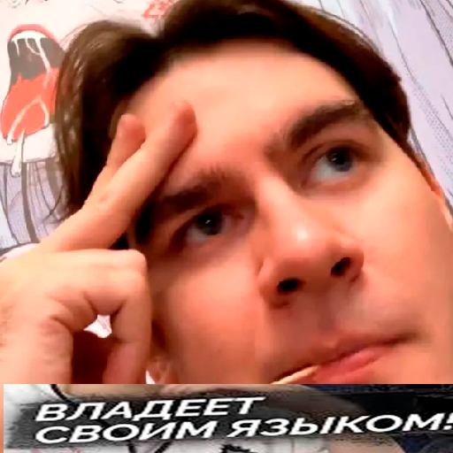
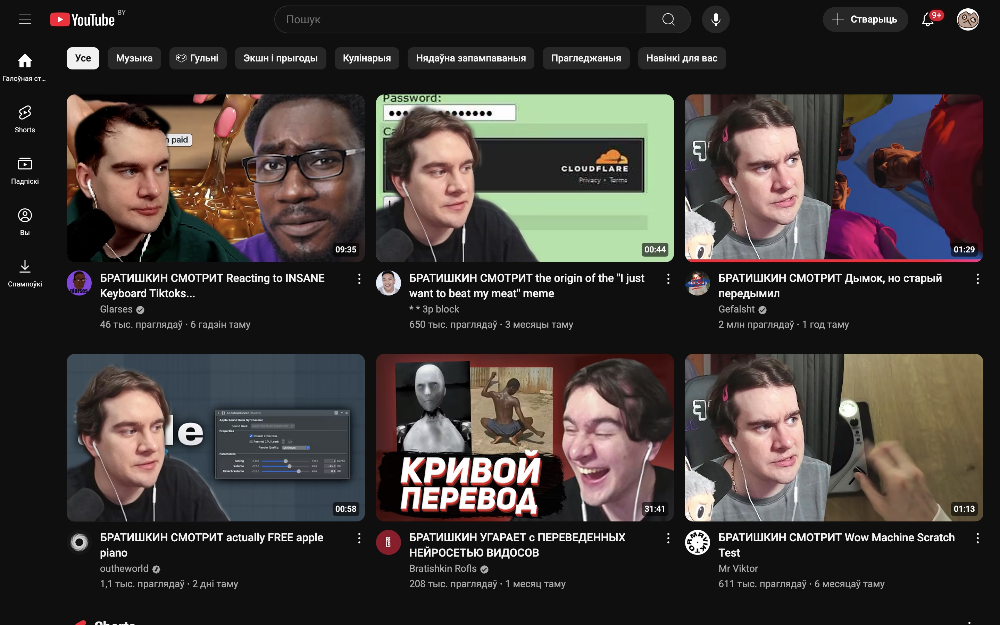
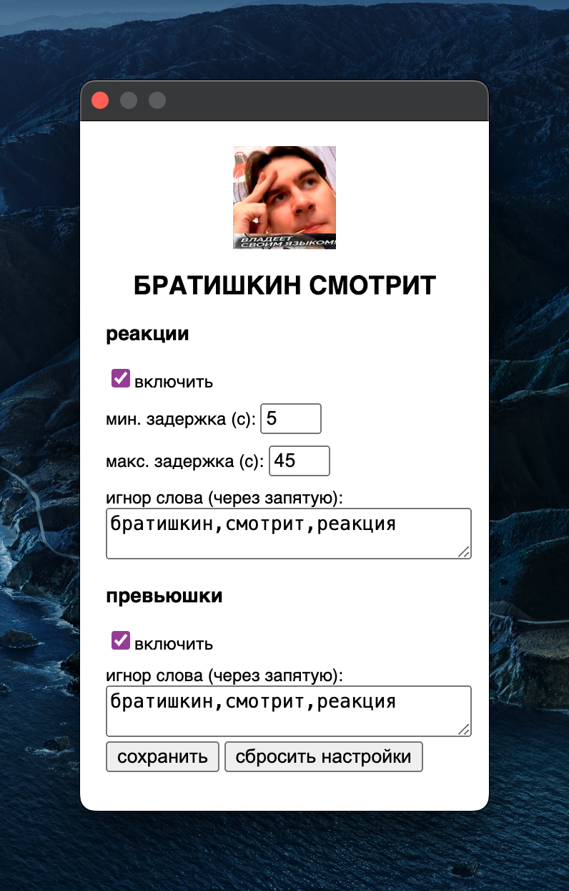

  

<b>БРАТИШКИН СМОТРИТ</b>

### Братишкин для твоего ютуба
Братишкин пересмотрел весь ютуб и тебе всё это досутпно

#### Возможности
* Модификация превьюшек
  Возможно фильтровать видео по названию видео, которые братишкин не посмотрел
  

    
Посмотреть реализацию

    
  

* Реакция
  Возможно настраивать интервал когда братишкин будет стопать (минимальный и максимальный интервал)
  Так же возможно фильтровать по названию видео, где не будет реакции
  

    
Посмотреть реализацию

    <video src="https://github.com/user-attachments/assets/7d802159-b9c4-43a2-a4d1-219e35e898bc" />
  

* Настройка
  Возможность настройки всего выше перечисленного, открывается при нажатии на расширение в списке расширений
  

    
Посмотреть реализацию

    
  

